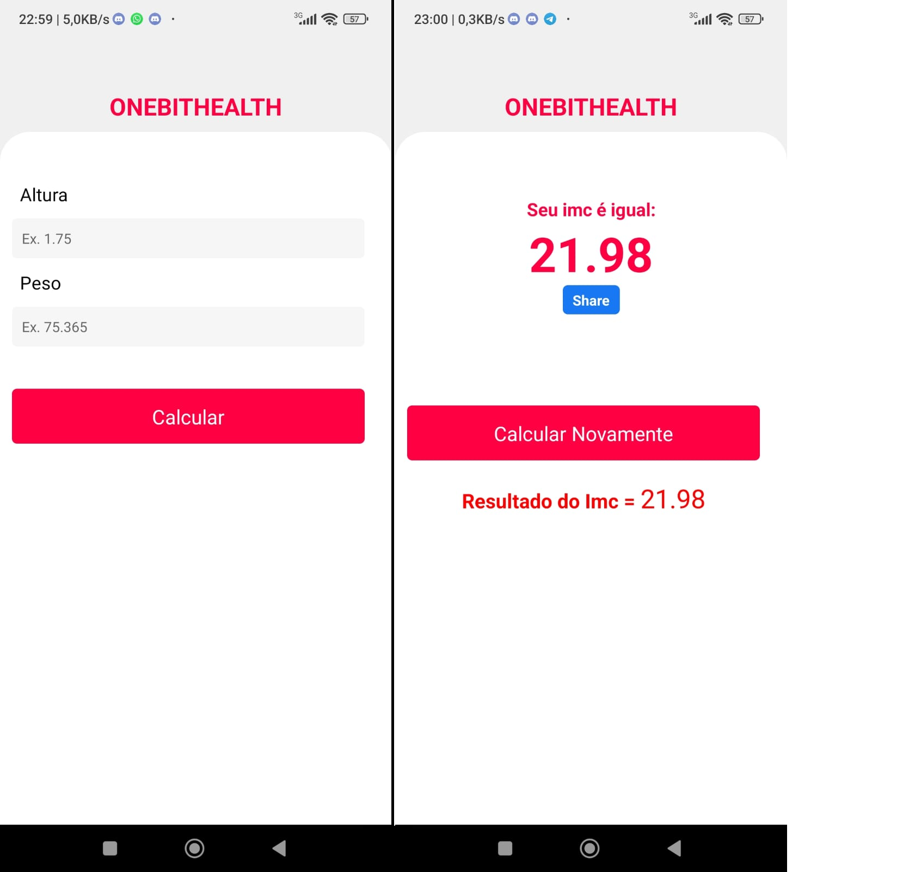

<h1 align="center"> 
    Cálculo-Imc-With-React-Native
</h1>

  <a href="#-About">About</a>&nbsp;&nbsp;&nbsp;|&nbsp;&nbsp;&nbsp;
  <a href="#-Project">Project</a>&nbsp;&nbsp;&nbsp;|&nbsp;&nbsp;&nbsp;
  <a href="#-Technology">Technology</a>

    

<h5 style="text-align: center"> Thank you for see !</h5>

## 📚 Sobre

Olá, tudo bem? Para realização desse projeto de React Native foi usado como fonte o canal **One Bit Code**, onde foi ministrado pelo **Felipe Moreira**. Através desse projeto aprendemos como **desenvolver cálculo de IMC com React Native**. Aprendemos componentes básicos como: **_View_**, **_Text_**, **_TextInput_**, **_TextButton_** entre outros, além de saber como utilizar **componentes de interface do usuário** como: **_Button_**, **_Switch_**. Em continuação aprendemos toda lógica na nossa aplicação apresentando operadores de diferente **_(!)_** igual **_(=)_** igual e/ou diferente **_(!=)_** e o famoso AND **_(&&)_**, além de setar valores como **_null_**. De certa forma lidamos muito com condicionais de **_if_** em relação a validação de funções setamos os estados na hora de manipular ele, trabalhamos com o evento **_onChange_** que é algo comum utilizar em SPA como o **_React_**, tendo a mesma lógica de alterar algo sendo texto ou o estado da nossa altura como foi realizado quando utilizamos o **_<TextInput_**. Coisas que foram muito positivas de fato foi a não utilização de passar unidade de tamanho sendo eles: px, vh, rem, em etc. Foi um projeto básico de se ver mas bastante desafiador já que não tinha um bom dominio de React Native, mas que trouxe conceitos inrriquecedores. Posso concluir que podemos utilizar o React Native desde tarefas simples até coisas mais complexas como conexões com BD como: Firebase, RealmDB que será bastante útil.

Para ter acesso a conteúdo similares, acesse [One Bit Code](https://www.youtube.com/@OneBitCode)

## 🚀 Technology

O projeto foi desenvolvido a partir das tecnologias:

- *REACT NATIVE*

## 📚 About

Hello everything is fine? To carry out this React Native project, the **One Bit Code** channel was used as a source, where it was taught by **Felipe Moreira**. Through this project we learned how to **develop BMI calculation with React Native**. We learned basic components such as: **_View_**, **_Text_**, **_TextInput_**, **_TextButton_** among others, in addition to knowing how to use **user interface components** such as: **_Button_ **, **_Switch_**. In continuation we learn all the logic in our application presenting different operators **_(!)_** equal **_(=)_** equal and/or different **_(!=)_** and the famous AND **_(&&)_**, in addition to setting values ​​like **_null_**. In a way, we deal a lot with **_if_** conditionals in relation to function validation, we set the states when manipulating it, we work with the **_onChange_** event, which is something common to use in SPAs like **_React_* *, having the same logic of changing something being text or the state of our height as was done when we used **_<TextInput_**. Things that were very positive in fact was the non-use of passing size units, namely: px, vh, rem, em etc. It was a basic project to look at but quite challenging since I didn't have a good command of React Native, but it brought enriching concepts. I can conclude that we can use React Native from simple tasks to more complex things like DB connections like: Firebase, RealmDB that will be very useful.

*To access similar content, go to [One Bit Code](https://www.youtube.com/@OneBitCode)*

## 🚀 Technologies Used:

*The project was developed based on technologies:*

- *REACT NATIVE*

--------------

Developed by :atom_symbol: [**Arthur Silva**]([arthursj (ArthurSilva) (github.com)](https://github.com/arthursj))
